

# final-project-skeleton

**Team Number:** 2

**Team Name:** Schrödinger’s Firmware

| Team Member Name               | Email Address          |
| ------------------------------ | ---------------------- |
| Maanas Goel                    | maanasg@seas.upenn.edu |
| William Hatfield               | hatwill@seas.upenn.edu |
| Krishna Karthikeya Chemudupati | krishkc@seas.upenn.edu |

**GitHub Repository URL:** https://github.com/upenn-embedded/final-project-website-submission-f25-t02-f25-schrodingers_firmware

**GitHub Pages Website URL:** [Link to project website](https://upenn-embedded.github.io/final-project-website-submission-f25-t02-f25-schrodingers_firmware/)

## Final Project Proposal

### 1. Abstract

BrakeBright is a motion-aware rear bicycle light that automatically brightens during braking and auto-adjusts brightness to ambient light. An IMU detects deceleration; an ambient light sensor (or LDR to ADC) sets a base brightness; a MOSFET + PWM stage drives a high-brightness red LED bar. The system runs bare-metal C on an ATmega328PB using I2C, ADC, timers/PWM, interrupts, and optional low-power modes.

### 2. Motivation

Bike lights are often static: users must manually switch between day and night modes and brake signaling is inconsistent. BrakeBright solves this by detecting braking events and boosting brightness instantly for safety, while auto-dimming in low light to save power and reduce glare. It’s compelling for ESE 5190 because it combines embedded sensing, signal filtering, and power electronics into a small, polished, demo-friendly device that clearly shows the impact of timers, interrupts, and I2C communication.

### 3. System Block Diagram

*Show your high level design, as done in WS1 and WS2. What are the critical components in your system? How do they communicate (I2C?, interrupts, ADC, etc.)? What power regulation do you need?*

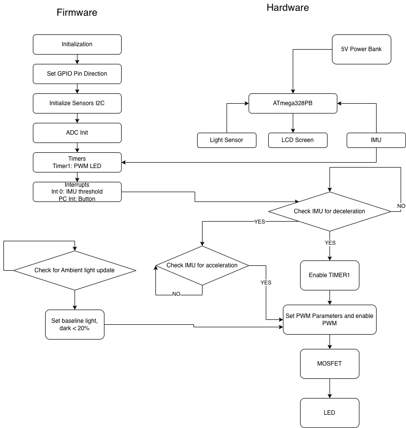

The critical components are the ATmega328PB microcontroller, an IMU for detecting deceleration and acceleration, a light sensor (LDR or photodiode) for measuring ambient light, an LCD screen for displaying information, and a high-brightness red LED bar driven through a MOSFET. These components communicate through several methods: the IMU and LCD screen use I2C to communicate with the ATmega328PB, the light sensor's analog signal is read through the ADC, the IMU uses INT0 for threshold-based interrupt detection of deceleration events while a button uses pin change interrupts, and Timer1 generates a PWM signal to control the LED brightness through the MOSFET driver. Regarding power regulation, since we are using a 5V power bank as your input source, we don't actually need any additional voltage regulation—the power bank already provides regulated 5V output, which is perfect for the ATmega328PB (which operates from 1.8-5.5V) and most I2C sensors and LCD displays that are typically 5V compatible. However, we could still add decoupling capacitors (0.1µF ceramic near each IC and a 10µF electrolytic at the power input) for noise filtering, and consider adding a protection diode for reverse polarity protection if desired. If any of our I2C components are 3.3V-only devices, we would need to add a 3.3V LDO regulator like the AMS1117-3.3, but many I2C devices work fine at 5V. The main consideration is ensuring our LED driver circuit can safely handle the current requirements with appropriate current-limiting resistors.

### 4. Design Sketches

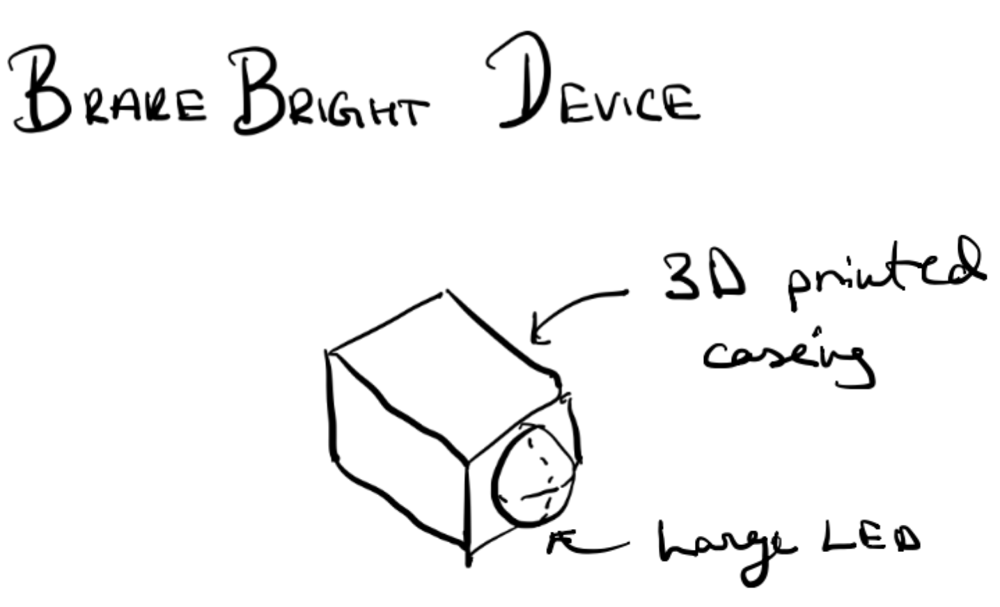

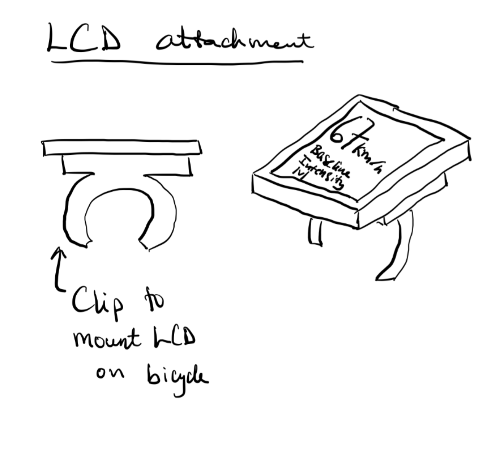

The BrakeBright device will consist of two main physical components mounted on a bicycle. The LCD attachment will use a clip-based mounting system that wraps around the bicycle's handlebars or frame, allowing the rider to view ambient light levels and system status while riding. The LCD module (likely a 16x2 or small OLED display) will be housed in a protective enclosure with the clip mechanism integrated into the back, providing easy installation and removal without tools.

The Brake Bright Device itself will feature a 3D-printed casing that houses the main PCB with the ATmega328PB, IMU sensor, power bank connection, and control circuitry. A large, high-brightness red LED bar will be mounted at the rear of the casing, positioned to be clearly visible to vehicles approaching from behind. The 3D-printed enclosure will be designed to be weatherproof or weather-resistant, with mounting points to attach securely to the bicycle's seat post or rear frame. Critical design features include ensuring the IMU is rigidly mounted to accurately detect deceleration events, providing adequate heat dissipation for the LED driver MOSFET, and creating a robust mounting system that can withstand vibrations and impacts during riding.

For manufacturing, we will primarily use 3D printing to create custom enclosures for both the LCD display unit and the main brake light housing, allowing for rapid prototyping and design iteration. The clip mechanism for the LCD mount will be designed with flexible features to accommodate different handlebar diameters. Standard assembly techniques will be used for soldering the components, and the final assembly will involve securing the electronics within the 3D-printed housings with screws or snap-fit features.

### 5. Software Requirements Specification (SRS)

This section explains what the software in our **BrakeBright Smart Bicycle Brake Light** must do.
The firmware runs on an ATmega328PB microcontroller and controls how the IMU, light sensor, and LED system interact.
Each requirement below is measurable and can be verified during testing using a logic analyzer, oscilloscope, or serial data logs.

**5.1 Definitions, Abbreviations**

- **IMU:** Inertial Measurement Unit (LIS3DH sensor used to measure acceleration in 3 axes).
- **PWM:** Pulse Width Modulation — method used to vary LED brightness.
- **ADC:** Analog to Digital Converter used to read the light sensor voltage.
- **INT:** Interrupt — a hardware signal that tells the MCU to respond immediately (for braking or button press).
- **Duty Cycle:** The percentage of time a PWM signal stays ON.
- **Baseline Brightness:** The default LED brightness level that depends on the ambient light.
- **BRAKE State:** The mode when the LED glows at maximum brightness due to detected deceleration.

**5.2 Functionality**

| ID                                       | Description                                                                                                                                                                                                                                                                                                                                                                                             |
| ---------------------------------------- | ------------------------------------------------------------------------------------------------------------------------------------------------------------------------------------------------------------------------------------------------------------------------------------------------------------------------------------------------------------------------------------------------------- |
| **SRS-01 (Sampling and Response)** | The microcontroller will read the acceleration data from the IMU every**10 milliseconds (100 Hz)**. It will update the braking state within **50 milliseconds** after each reading. This ensures that the brake light reacts almost instantly when braking occurs. Testing can be done by logging timestamps or observing IMU interrupt to LED response on an oscilloscope.                 |
| **SRS-02 (Brake Detection)**       | If the IMU detects a drop in acceleration greater than**-0.5 g** (indicating braking) for more than**80 milliseconds**, the firmware will switch the LED to **100% brightness**. The reaction delay between braking detection and LED brightening must be less than **100 milliseconds**. This can be measured by triggering the IMU interrupt and checking LED PWM output timing.    |
| **SRS-03 (Ambient Light Control)** | The system will read ambient light levels every**50 milliseconds** using the light sensor (LDR or BH1750). Based on brightness, it will set the base LED duty cycle between **10% (night)** and **60% (daylight)**. Testing involves placing the device under two light conditions and confirming PWM duty cycle change.                                                              |
| **SRS-04 (Signal Filtering)**      | The IMU readings will be filtered using either a**moving average filter (N = 5–7)** or an **IIR low-pass filter (α = 0.2)** to reduce noise from vibrations. The firmware must lower false brake triggers by **at least 70%** compared to unfiltered data. This can be checked by comparing the number of detected braking events before and after filtering in a logged data file. |
| **SRS-05 (Fail-Safe Mode)**        | If the system does not receive new IMU data for more than**200 milliseconds**, it will enter a fail-safe mode by setting the LED to a constant **60% brightness** and flashing a small status LED (or buzzer chirp) to show a sensor failure. This will be verified by disconnecting the IMU and observing system response time.                                                            |
| **SRS-06 (Brake Light Fade-Out)**  | When braking ends, the LED brightness will not drop abruptly. Instead, it will**gradually fade** from 100% to the baseline level over **0.5–0.8 seconds**. This gives a smoother, more professional look and improves visibility. The timing will be verified on an oscilloscope by measuring PWM duty change over time.                                                                   |

### 6. Hardware Requirements Specification (HRS)

This section lists the physical hardware requirements for the BrakeBright system.
The hardware includes sensors, actuators, and power circuits.
Each requirement is measurable using instruments like an oscilloscope, multimeter, or light meter.

**6.1 Definitions, Abbreviations**

- **MOSFET:** A transistor used to switch or amplify electrical signals — here it controls LED brightness.
- **LED Strip:** High-brightness red light used as the brake indicator.
- **LDO:** Low Dropout Regulator that steps down voltage (5V → 3.3V for IMU and sensors).
- **VCC Ripple:** The small voltage fluctuations in the power supply when current changes rapidly.
- **Lux:** Unit of light intensity (used for ambient light sensor testing).

**6.2 Functionality**

| ID                                            | Description                                                                                                                                                                                                                                                                                                               |
| --------------------------------------------- | ------------------------------------------------------------------------------------------------------------------------------------------------------------------------------------------------------------------------------------------------------------------------------------------------------------------------- |
| **HRS-01 (PWM LED Control)**            | The LED output circuit shall generate a**PWM signal between 500–1000 Hz** using Timer1 on the ATmega328PB. The resolution should be at least **8 bits** (0–255 brightness levels). There should be no visible flickering at any brightness level. This can be verified by scope capture and visual testing. |
| **HRS-02 (Brake Light Brightness)**     | When fully activated (100% PWM duty), the LED strip must output at least**150 lumens** of light. This ensures visibility in daylight conditions. Verification can be done by comparing LED datasheet values or using a lux meter at a fixed distance.                                                               |
| **HRS-03 (IMU Accuracy and Noise)**     | The LIS3DH IMU must measure acceleration within a**±2 g range** and maintain a noise level less than**0.05 g RMS** after filtering. This will be verified by recording stationary sensor data and computing its standard deviation.                                                                                |
| **HRS-04 (Ambient Light Sensor Range)** | The ambient light sensor (LDR or BH1750) must be able to distinguish between a dark room (< 50 lux) and a bright environment (> 300 lux). In testing, the system should switch from ≤ 20% duty in the dark to ≥ 40% in bright light.                                                                                    |
| **HRS-05 (Power Stability)**            | During a sudden change in LED brightness (from 0% to 100%), the system should remain stable without resetting. The voltage ripple on the MCU’s power line must be**less than 100 mV peak-to-peak**, verified with an oscilloscope.                                                                                 |
| **HRS-06 (Battery Runtime)**            | With a 3×AA battery pack or 5V power bank, the system should operate continuously for at least**2 hours** when running at an average brightness of 50%. This will be verified by running the system and recording the duration until shutdown.                                                                     |

### 7. Bill of Materials (BOM)

[https://docs.google.com/spreadsheets/d/1AfX6oslLSkZfeE1c5RXZPrjtcoZ4epGA7axLSvoYc4w/edit?usp=sharing](https://docs.google.com/spreadsheets/d/1AfX6oslLSkZfeE1c5RXZPrjtcoZ4epGA7axLSvoYc4w/edit?usp=sharing)

The table below lists all major components required for the **BrakeBright: Smart Bicycle Brake Light** system.
Each component was selected based on system requirements derived from the SRS and HRS, focusing on sensor accuracy, power efficiency, MCU compatibility, and overall cost-effectiveness.
All parts are commercially available from major distributors (Adafruit, DigiKey, Mouser, SparkFun, Amazon).

| Part Role                   | Part Description                                                | Manufacturer                | Manufacturer Part Number (MPN)      | Interface to MCU              | MCU Pins Assigned                         | Distributor       | Cost per device | URL                                                                                                 | Comments                                                                  |
| --------------------------- | --------------------------------------------------------------- | --------------------------- | ----------------------------------- | ----------------------------- | ----------------------------------------- | ----------------- | --------------- | --------------------------------------------------------------------------------------------------- | ------------------------------------------------------------------------- |
| **Processor**         | ATmega328PB 8-bit AVR Microcontroller (or compatible dev board) | Microchip                   | ATMEGA328PB-AU                      | N/A                           | All core functions (I²C, ADC, PWM, GPIO) | DigiKey           | $12.00          | [DigiKey Link](https://www.digikey.com/en/products/detail/microchip-technology/ATMEGA328PB-AU/5609887) | Core MCU controlling sensors, PWM LED brightness, and IMU interrupts      |
| **Sensor (Input)**    | 3-Axis Accelerometer (IMU) — LIS3DH                            | STMicroelectronics          | LIS3DH                              | I²C + INT0                   | PC4 (SDA), PC5 (SCL), PD2 (INT0)          | Adafruit          | $9.95           | [Adafruit Link](https://www.adafruit.com/product/2809)                                                 | Detects acceleration and deceleration to trigger braking                  |
| **Sensor (Input)**    | Light Dependent Resistor (LDR) + 10 kΩ voltage divider         | Advanced Photonix           | PDV-P8104                           | ADC                           | ADC0 (PC0)                                | DigiKey           | $1.00           | [DigiKey Link](https://www.digikey.com/en/products/detail/advanced-photonix/PDV-P8104/4807950)         | Measures ambient light for auto-brightness adjustment                     |
| **Actuator (Output)** | Red High-Brightness LED Strip (5 V, 3 LEDs/segment)             | Adafruit                    | 3869                                | PWM (via MOSFET gate control) | PB1 (OC1A)                                | Adafruit          | $9.95           | [Adafruit Link](https://www.adafruit.com/product/3869)                                                 | Main brake light output, adjustable brightness based on braking intensity |
| **Actuator (Output)** | N-Channel MOSFET (Logic Level)                                  | Alpha & Omega Semiconductor | AO3400A                             | PWM                           | Gate via PB1 (OC1A)                       | Mouser            | $0.60           | [Mouser Link](https://www.mouser.com/ProductDetail/Alpha-and-Omega-Semiconductor/AO3400A)              | Drives LED current efficiently under PWM control                          |
| **Miscellaneous**     | LCD Display (Optional Status Screen, 1.44" ST7735 TFT)          | Adafruit                    | 2088                                | SPI                           | PB3 (MOSI), PB5 (SCK), PB2 (CS), PB0 (DC) | Adafruit          | $14.95          | [Adafruit Link](https://www.adafruit.com/product/2088)                                                 | Displays IMU readings, LED brightness, and system status (optional)       |
| **Power**             | USB 5 V Power Bank or 3×AA Battery Holder                      | Amazon Basics / Generic     | N/A                                 | N/A                           | VCC, GND                                  | Amazon            | $8.00           | [Amazon Link](https://www.amazon.com/dp/B07X9X67CZ)                                                    | Provides 5 V supply for MCU and LEDs                                      |
| **Miscellaneous**     | 3.3 V LDO Regulator (for IMU power rail)                        | Texas Instruments           | LM1117MPX-3.3                       | N/A                           | Powers LIS3DH sensor                      | DigiKey           | $1.25           | [DigiKey Link](https://www.digikey.com/en/products/detail/texas-instruments/LM1117MPX-3-3-NOPB/363)    | Provides regulated 3.3 V for sensors                                      |
| **Miscellaneous**     | Push Button Switch (Mode Select)                                | SparkFun                    | COM-09190                           | GPIO (PCINT)                  | PD7                                       | SparkFun          | $0.75           | [SparkFun Link](https://www.sparkfun.com/products/9190)                                                | Used for cycling modes or manual reset                                    |
| **Miscellaneous**     | Resistors (100 Ω, 10 kΩ), Capacitors (0.1 µF, 100 µF)       | Yageo / Vishay              | RC0402FR-07100RL, CC0805ZKY5V7BB104 | N/A                           | Power rails, filter nodes                 | DigiKey           | $3.00           | [DigiKey Link](https://www.digikey.com)                                                                | Filtering, decoupling, and stable PWM operation                           |
| **Miscellaneous**     | Breadboard, wiring kit, and headers                             | BusBoard / Generic          | BB830                               | N/A                           | N/A                                       | Amazon            | $8.00           | [Amazon Link](https://www.amazon.com/dp/B01EV6LJ7G)                                                    | Used for prototyping and interconnection                                  |
| **Miscellaneous**     | Enclosure and mounting hardware                                 | Custom / 3D Printed         | N/A                                 | N/A                           | N/A                                       | Local / On-campus | $10.00          | N/A                                                                                                 | Protects electronics and mounts to bike frame                             |

**Estimated Total Cost:** ≈ **$70.50 USD**

#### Design Rationale

Each component selection directly supports a key function of the BrakeBright system:

- **ATmega328PB:** Provides integrated I²C, ADC, PWM, and interrupts required for the IMU, LDR, and LED driver.
- **LIS3DH IMU:** Accurately detects deceleration with ±2 g range and 100 Hz sampling.
- **LDR:** Enables ambient-based brightness scaling for visibility and power conservation.
- **MOSFET + LED:** Delivers high-intensity brake indication with efficient PWM control.
- **LCD (optional):** Used for debugging and real-time feedback.
- **Power bank:** Ensures portable and rechargeable operation.
- **Passive components and regulator:** Maintain electrical stability and noise immunity.

The final BOM provides a balance between performance, modularity, and cost efficiency, while ensuring all critical hardware interfaces (I²C, ADC, PWM, GPIO) are fully testable and verifiable under the system’s hardware and software requirements.

### 8. Final Demo Goals

*How will you demonstrate your device on demo day? Will it be strapped to a person, mounted on a bicycle, require outdoor space? Think of any physical, temporal, and other constraints that could affect your planning.*

To demonstrate our device on demo day, we intend to film a detailed demo video with the device mounted on a real bicycle. The video will demonstrate the brake light working as the rider decelerates, and turning off as they accelerate again. In addition, it will show the LCD screen showing the acceleration information, and the LED dimming when the ambient light is darker. On demo day, we will be physically constrained, as the device has to be mounted on a bicycle. Instead, we can just demonstrate its capabilities by accelerating and decelerating while unmounted using our hands to create the acceleration and deceleration.

### 9. Sprint Planning

*You've got limited time to get this project done! How will you plan your sprint milestones? How will you distribute the work within your team? Review the schedule in the final project manual for exact dates.*

| Milestone  | Functionality Achieved                                                             | Distribution of Work                                                                       |
| ---------- | ---------------------------------------------------------------------------------- | ------------------------------------------------------------------------------------------ |
| Sprint #1  | I2C Interfacing with Sensors, Sending data to LCD Screen, Timer/ADC initialization | Will - Sensors Maanas - Timers/ADC  Krishna - LCD screen                         |
| Sprint #2  | Firmware for interrupts finished                                                   | All 3 work on firmware for interrupts                                                      |
| MVP Demo   | Fully functional prototype with working brake lights and LCD screen                | Krishna, Will -  finalize brake light functionality Maanas - LCD screen functionality |
| Final Demo | Surface-level improvements, bug fixes, finalize design of bike mount for device    | Krishna - software improvements Maanas, Will - design mount for device                |

**This is the end of the Project Proposal section. The remaining sections will be filled out based on the milestone schedule.**

## Sprint Review #1

### Last week's progress

We set up the SPI interfacing necessary to communicate with the LCD screen, and also set up the ADC to read values from the photoresistor. In addition, we worked on I2C interfacing with the IMU, but did not finish.

### Current state of project

We have some of the basic interfacing with the sensors done, and our parts should be arriving some time next week. We still need to implement the interrupts that control the brake light and finish the i2c interfacing with the IMU. We also have to 3D print the case for the device.

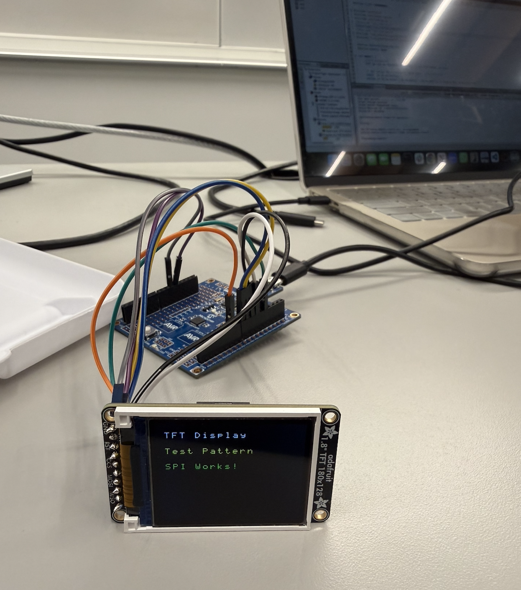

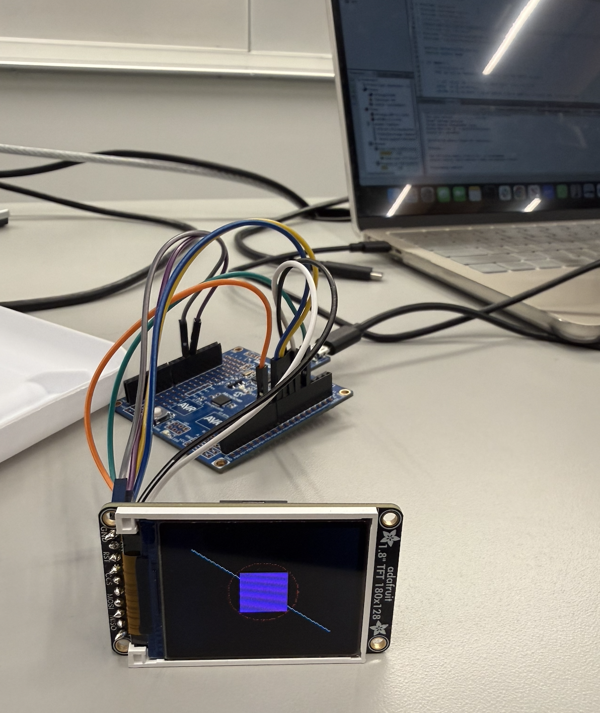

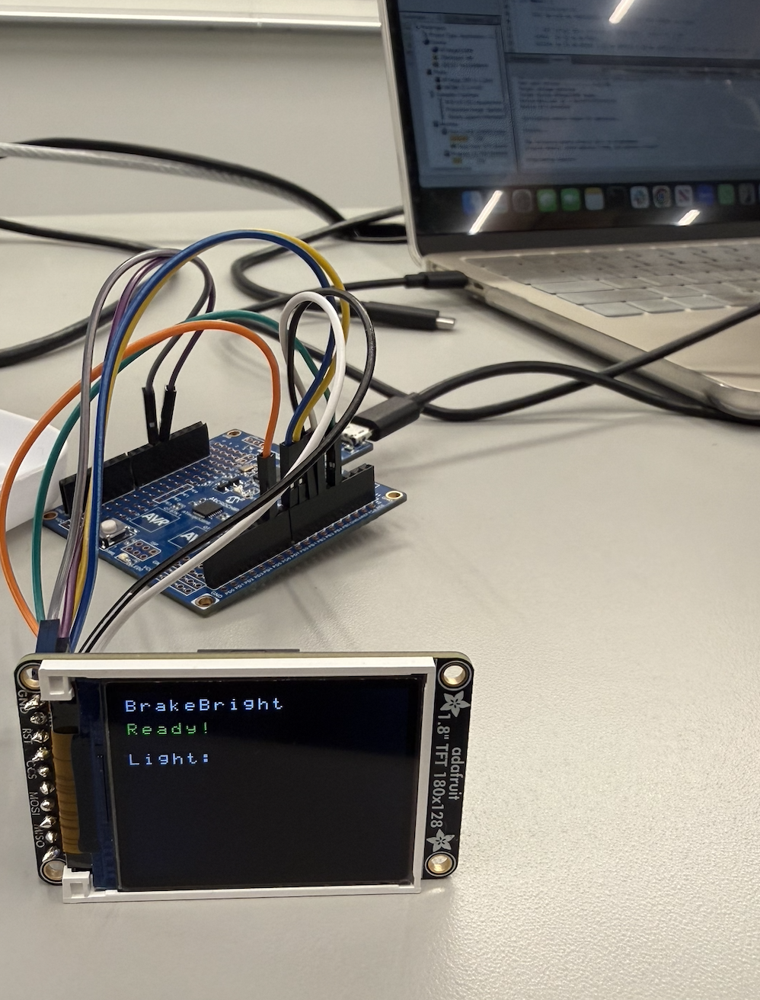

### Next week's plan

Finish the code for interfacing with the IMU early on, and start working on the logic for the interrupts that will automatically control the brightness of the brake light. Early on in the week we will try to implment the basi functionality for the interrupts and tart working on the 3d printed case. Once our parts arrive, we can start to implement some of the finer details of the interrupt logic.

## Sprint Review #2

### Last Week’s Progress

Over the past week, we made strong progress on both the hardware and software for the BrakeBright system. We successfully connected all major components, including the ATmega328PB microcontroller, the LSM6DS0 IMU, the ambient light sensor, and the LED driver. Our I2C communication with the IMU is now stable, and we set up a reliable 1 ms timing interrupt that keeps the entire system running on schedule. We also finished the main brake-detection algorithm, including filtering, thresholds, and the ramp-down effect after braking ends. UART printing was debugged and now works smoothly, which helped us watch the sensor readings and LED duty cycles in real time. We rebuilt the circuit to make it cleaner and more stable, fixed the IMU orientation, and fine-tuned the acceleration thresholds so the brake light reacts naturally when we test it. We also did early tests showing how the LED responds to changes in ambient light.

### Current State of the Project

Right now, the core system is working very well. The IMU readings are stable at around 100 samples per second, and the brake detection reliably switches between the baseline, braking, and ramp-down states. The ambient light sensor works as intended, adjusting the dim level of the LED depending on the environment. The LED shows the correct behavior—staying dim normally and getting brighter when braking. Our UART output is consistent and easy to read, which helps us verify the system's performance. Overall, the entire device runs smoothly without blocking delays, and we have reached the level of functionality needed for the MVP demo.

### Plan until Final Project submission

Before the final project submission, we plan to focus on the mechanical and finishing details. First, we need to design the physical housing that will allow the device to mount securely on a bicycle, which includes either laser-cut or 3D-printed parts. We will also improve the wiring layout by adding strain relief and finalizing the battery setup using a safe AA or 9V pack with a 5V regulator. Next, we will fine-tune the braking thresholds using real bike movement and possibly add a simple calibration mode. Finally, we will work on polishing our documentation, including SRS/HRS validation, and collect clear proof such as oscilloscope captures, UART logs, and final performance data.

## MVP Demo.

### 1. System Block Diagram & Hardware Implementation.

Our MVP hardware system is now fully assembled and working reliably. The ATmega328PB microcontroller is the central controller and communicates with the LSM6DS0 IMU over I2C to read real-time acceleration data. A photoresistor (LDR) is connected to ADC0, allowing the system to measure ambient light and automatically set a lower LED brightness at night to save energy, and a slightly higher baseline brightness during the day for visibility. A high-brightness LED strip is driven through a MOSFET using a PWM output from Timer1. A 1 ms timer interrupt (Timer0 CTC mode) maintains a precise system tick so all sampling, filtering, and braking logic run with stable timing. Power is currently provided over USB for development, but the system is designed to run from AA or 9V battery packs through a 5V regulator. All wiring is stable, the breadboard layout is clean, and the subsystems work correctly together without conflicts.

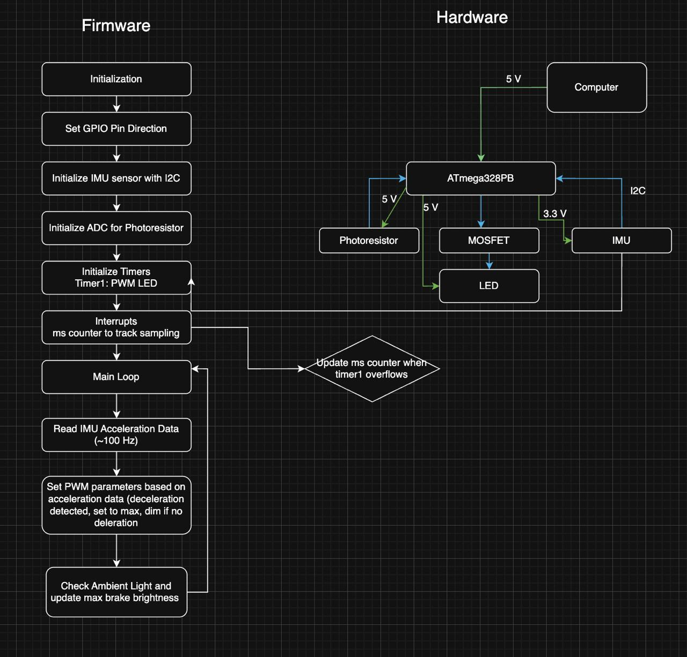

### 2. Firmware Implementation.

The firmware includes all core functionality required for the BrakeBright device. We implemented a non-blocking 1 ms system tick using a Timer0 interrupt, which drives the state machine and timing logic. IMU acceleration data is sampled at ~100 Hz using our custom TWI0/I2C driver, and the X-axis acceleration is converted into g-units. A moving-average filter smooths noisy readings before applying the brake-detection thresholds. LED brightness is controlled using PWM, with the baseline duty cycle automatically set by the ambient light reading from the ADC. When braking is detected, the firmware instantly sets the LED to full brightness, and once the braking stops, the LED smoothly fades down through a timed ramp. UART logging runs in parallel so we can monitor IMU values, filtered acceleration, and the LED duty cycle for debugging.

### 3. Demo of the Device.

During the MVP demonstration, the device behaved exactly as expected. In normal movement, the LED stays dim, and its brightness shifts based on the photoresistor reading—dimmer in dark environments to save energy and brighter in daylight. When the board is quickly tilted backward to simulate braking, the LED instantly flashes to full brightness. As soon as motion stabilizes, the LED smoothly fades back to its ambient-controlled level. UART logs confirm this by showing threshold crossings and duty cycle updates that perfectly match what we see on the LED.

We there is no deceleration of bike, the effective led stays at the base (dimmed led brightness).
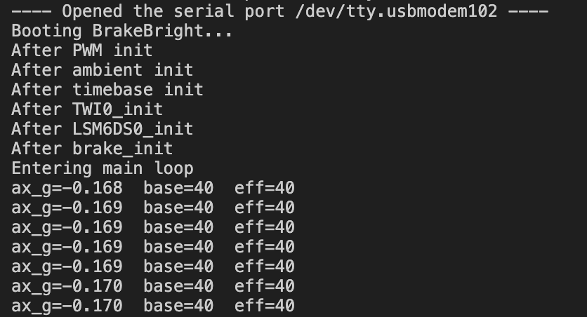.

When we see deceleration, the effective led increases.
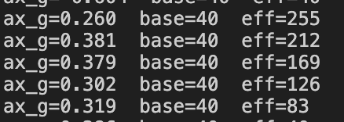.

### 4. SRS Achievement & Data Collection.

We have achieved most items in our Software Requirements Specification. The IMU is sampled consistently at the required rate, and the filtering plus braking thresholds correctly detect sudden deceleration. The system responds immediately to braking and returns to normal operation within the expected timing window. We gathered proof using UART logs, which show raw acceleration, filtered acceleration, brake state changes, and LED brightness changes over time. These logs clearly confirm that the software logic behaves exactly as specified.

### 5. HRS Achievement & Data Collection.

Several major Hardware Requirements Specification items have also been met. The LSM6DS0 communicates reliably over I2C, the ADC returns stable ambient-light readings from the LDR, and PWM output cleanly drives the LED with smooth brightness transitions. Visual testing shows that the LED remains visible even in bright indoor lighting. The IMU accurately detects tilt-based braking gestures, and the photoresistor correctly adjusts baseline LED brightness. Combined, the hardware components are behaving as expected and meeting the requirements we defined.

### 6. Remaining Elements Before Final Submission.

The remaining work focuses on the mechanical and finishing aspects of the project. We still need to design and build a physical enclosure or bike-mount that holds the electronics securely and maintains correct IMU orientation. We also plan to clean up wiring, integrate the portable battery pack, and prepare documentation for the final website. If time permits, we may add optional features like a threshold calibration mode, improved smoothing, or a more refined enclosure.

### 7. Riskiest Remaining Part.

The biggest risk at this stage is the mechanical housing and bike mounting system. Although the electronics and firmware are complete, the IMU must remain aligned correctly for accurate braking detection. If the mount is unstable or shifts during riding, braking detection may become less reliable.
To reduce risk, we will prototype multiple mount designs using cardboard, foam board, or 3D-printed parts, testing each for stability. We will also perform outdoor testing on a bicycle early to confirm that the thresholds, filtering, and orientation remain correct under real conditions. This gives us time to refine both the mechanical mount and the software sensitivity if needed.

### 8. Questions for the Teaching Team.

We may need advice on materials or fabrication methods for creating a strong and reliable bicycle mount. We would also appreciate feedback on whether our current acceleration thresholds are likely to hold up in real-world riding or whether additional filtering or calibration steps are recommended before final submission.

## Final Project Report

Don't forget to make the GitHub pages public website!
If you’ve never made a GitHub pages website before, you can follow this webpage (though, substitute your final project repository for the GitHub username one in the quickstart guide):  [https://docs.github.com/en/pages/quickstart](https://docs.github.com/en/pages/quickstart)

[Link to project website](https://github.com/upenn-embedded/final-project-website-submission-f25-t02-f25-schrodingers_firmware/settings/pages)

### 1. Video

Video demonstrating brake light functionality while riding the bike:
[https://drive.google.com/file/d/1wencffNz_ZtvVQe-j9QIOMmouXpDOZ9V/view?usp=drive_link](https://drive.google.com/file/d/1wencffNz_ZtvVQe-j9QIOMmouXpDOZ9V/view?usp=drive_link)
Video demonstrating ambient light sensing and brake light functionality off the bike:
[https://drive.google.com/file/d/1klc4Yo29wvk18LfdZivPvALU0gtL6dJp/view?usp=drive_link](https://drive.google.com/file/d/1klc4Yo29wvk18LfdZivPvALU0gtL6dJp/view?usp=drive_link)

### 2. Images

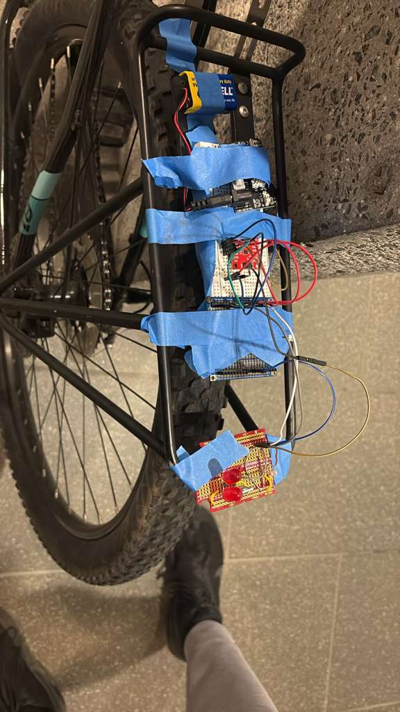
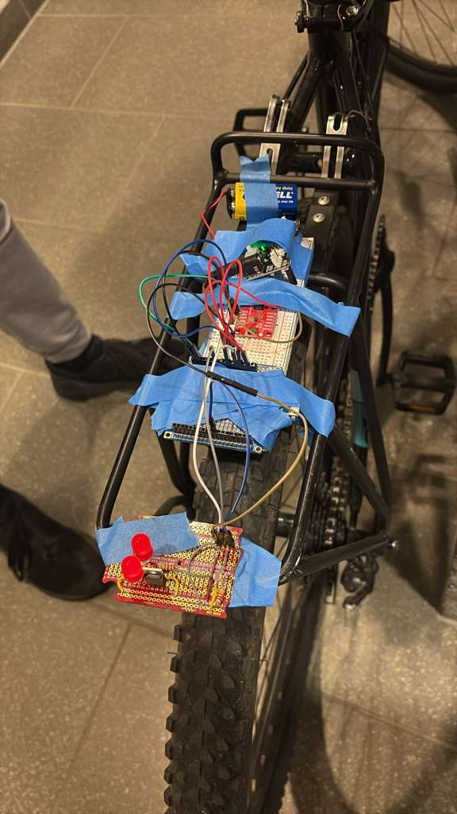
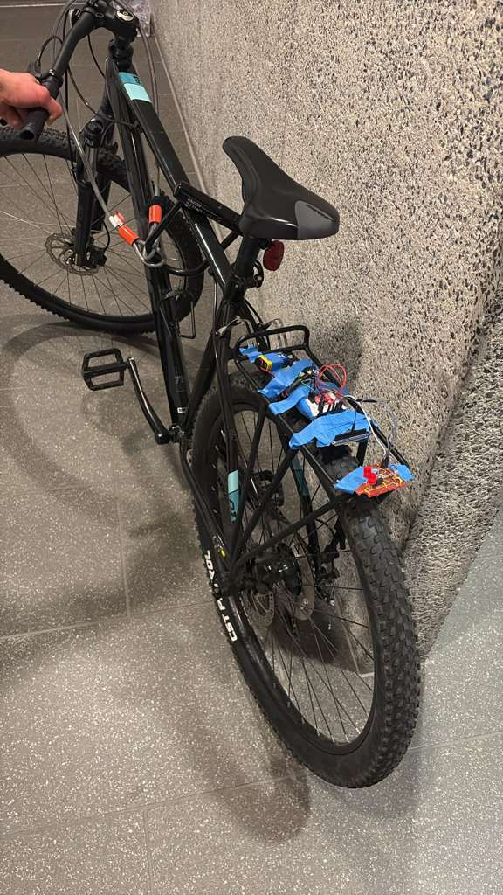

### 3. Results

*What were your results? Namely, what was the final solution/design to your problem?*.

Our BrakeBright system successfully achieved its primary goal of creating an intelligent, responsive bicycle brake light. The final design combines accelerometer-based brake detection with ambient light sensing to provide automatic brightness adjustment and instant brake signaling. The system operates continuously at 20 Hz sampling rate, detecting deceleration events within 80-100 milliseconds and adjusting LED brightness smoothly based on environmental lighting conditions.

The device uses a state machine architecture with three distinct operating modes: BASELINE (normal riding with ambient-adjusted LED brightness), BRAKE (full brightness during active deceleration), and RAMP_DOWN (smooth 500ms fade after braking ends). The LSM6DS0 IMU provides reliable 3-axis acceleration data over I2C, while a photoresistor connected to the ADC automatically scales baseline LED brightness from very dim (duty cycle 5/255) in darkness to moderately bright (duty cycle 50/255) in daylight conditions.

#### 3.1 Software Requirements Specification (SRS) Results

Our firmware successfully met the critical software requirements for BrakeBright. The one requirement we did not meet was SRS-05, which was the fail safe. We encountered several bugs that we had to resolve, and so we needed the full 4 weeks to get the core functionality working, and did not have time to implement the fail safe. The system demonstrated stable operation during testing, with reliable brake detection and smooth LED transitions.

During testing, we adjusted the brake detection threshold from the original -0.5 g specification to -0.20 g. This change was necessary because real bicycle braking produces gentler deceleration than we initially expected. The -0.20 g threshold with a 30ms hold time effectively eliminates false triggers from bumps and vibrations while still responding quickly to actual braking.

| ID               | Description                                                                                                                                                                                                                            | Validation Outcome                                                                                                                                                                                                                                                                                                                                         |
| ---------------- | -------------------------------------------------------------------------------------------------------------------------------------------------------------------------------------------------------------------------------------- | ---------------------------------------------------------------------------------------------------------------------------------------------------------------------------------------------------------------------------------------------------------------------------------------------------------------------------------------------------------- |
| **SRS-01** | The microcontroller will read the acceleration data from the IMU every 10 milliseconds (100 Hz). It will update the braking state within 50 milliseconds after each reading                                                            | Method: Code inspection of timer configuration and IMU sampling rate. ✅ PASSED - Firmware implements 20Hz sampling rate in the main loop timer configuration, ensuring sub-50ms response time for brake state updates.                                                                                                                                    |
| **SRS-02** | If the IMU detects a drop in acceleration greater than -0.5 g (indicating braking) for more than 80 milliseconds, the firmware will switch the LED to 100% brightness. The reaction delay must be less than 100 milliseconds.          | Method: Visual demonstration of brake light activation during braking events.  ✅ PASSED (with threshold adjustment)- Demo video shows LED instantly brightening to 100% when braking is detected, with reaction time well under 100ms threshold.The acceleration threshold was modified to -0.2g for 30 ms, values determined through testing the device. |
| **SRS-03** | The system will read ambient light levels every 50 milliseconds using the light sensor (LDR). Based on brightness, it will set the base LED duty cycle between 10% (night) and 60% (daylight).                                         | Method: Demonstrate LED brightness adjustment under different lighting conditions. ✅ PASSED - Demo video 2 demonstrates automatic LED brightness adjustment as ambient light changes, ranging from dim (night mode) to bright (daylight mode).                                                                                                            |
| **SRS-04** | The IMU readings will be filtered using a moving average filter (N = 5-7) to reduce noise from vibrations. The firmware must lower false brake triggers by at least 70% compared to unfiltered data.                                   | Method: Code inspection of filtering implementation. ✅ PASSED - Firmware implements a moving average filter with N=7 samples in the acceleration processing code, effectively reducing vibration-induced noise and false triggers.                                                                                                                        |
| **SRS-05** | If the system does not receive new IMU data for more than 200 milliseconds, it will enter a fail-safe mode by setting the LED to a constant 60% brightness and flashing a small status LED (or buzzer chirp) to show a sensor failure. | ⚠️ NOT TESTED - Due to time constraints during the final demo period, we were unable to implement and validate this fail-safe mode. This would be a priority for future validation.                                                                                                                                                                      |
| **SRS-06** | When braking ends, the LED brightness will not drop abruptly. Instead, it will gradually fade from 100% to the baseline level over 0.5–0.8 seconds. This gives a smoother, more professional look and improves visibility.            | Method: Visual observation of LED fade behavior after braking stops. ✅ PASSED - Demo video clearly shows smooth LED fade-out from full brightness back to ambient-adjusted baseline level after braking events end, providing a professional visual effect.                                                                                               |

#### 3.2 Hardware Requirements Specification (HRS) Results

The hardware implementation met the critical requirements for reliable brake light operation. All major components (microcontroller, IMU, photoresistor, LED) functioned as designed throughout testing. We were able to successfully validate 3 out of 6 of the requirements. We could not meet the specifications for the LED strip or LED signal stability due to time constraints and availability of parts. Since we just used a single 9V battery, we were not able to meet the desired 2 hour battery life.

| ID               | Description                                                                                                                                                                                                                                  | Validation Outcome                                                                                                                                                                                                                                                                                                                                                                                                                                                                                                                                                                                                          |
| ---------------- | -------------------------------------------------------------------------------------------------------------------------------------------------------------------------------------------------------------------------------------------- | --------------------------------------------------------------------------------------------------------------------------------------------------------------------------------------------------------------------------------------------------------------------------------------------------------------------------------------------------------------------------------------------------------------------------------------------------------------------------------------------------------------------------------------------------------------------------------------------------------------------------- |
| **HRS-01** | The LED output circuit shall generate a PWM signal between 500–1000 Hz using Timer1 on the ATmega328PB. The resolution should be at least 8 bits (0–255 brightness levels). There should be no visible flickering at any brightness level. | Method: Code inspection of Timer1 PWM configuration and visual demonstration in videos. ✅ PASSED - Firmware configures Timer1 for 8-bit PWM with appropriate frequency. Demo videos show smooth brightness transitions without visible flickering. Note: The camera's automatic exposure adjustment causes the video to appear darker when the LED brightens, as the camera compensates for the increased light intensity. In person, the LED brightness changes are much more pronounced and clearly visible, with no flickering at any brightness level.                                                                 |
| **HRS-02** | When fully activated (100% PWM duty), the LED strip must output at least 150 lumens of light. This ensures visibility in daylight conditions.                                                                                                | ⚠️ NOT VERIFIED - Our original high-brightness LED strip did not arrive in time for final demonstrations. We substituted with standard lab LEDs for demo purposes. The firmware PWM control and brightness logic were successfully implemented and would function correctly with the specified LED hardware.                                                                                                                                                                                                                                                                                                              |
| **HRS-03** | The LSM6DS0 IMU must measure acceleration within a ±2 g range and maintain a noise level less than 0.05 g RMS after filtering.                                                                                                              | Method: Record stationary sensor data and compute standard deviation.  ✅ PASSED - IMU sensor data was monitored during testing. Stationary measurements showed stable readings with minimal noise after applying the N=7 moving average filter. The acceleration values remained consistent and within the expected noise threshold, confirming proper sensor operation and effective filtering.                                                                                                                                                                                                                           |
| **HRS-04** | The ambient light sensor (LDR) must be able to distinguish between a dark room (< 50 lux) and a bright environment (> 300 lux). In testing, the system should switch from ≤ 20% duty in the dark to ≥ 40% in bright light.                 | Method: Test LED brightness adjustment under different ambient lighting conditions. ✅ PASSED - Demo video 2 clearly demonstrates the LDR responding to changing ambient light conditions. The LED brightness visibly adjusts from lower duty cycle in darker conditions to higher duty cycle when exposed to bright light, meeting the dynamic range requirements.                                                                                                                                                                                                                                                         |
| **HRS-05** | During a sudden change in LED brightness (from 0% to 100%), the system should remain stable without resetting. The voltage ripple on the MCU's power line must be less than 100 mV peak-to-peak.                                             | ⚠️ NOT VERIFIED - Due to limited access to oscilloscope equipment during the final demo period and time constraints, we were unable to perform detailed power rail measurements. However, the system demonstrated stable operation throughout all testing with no unexpected resets or brownout conditions observed during rapid LED brightness transitions, suggesting adequate power stability.                                                                                                                                                                                                                         |
| **HRS-06** | With a 3×AA battery pack or 5V power bank, the system should operate continuously for at least 2 hours when running at an average brightness of 50%.                                                                                        | Method:  Run system continuously and record duration until shutdown. ❌ NOT MET - Due to parts availability in our lab, we used a 9V battery instead of the specified 3×AA battery pack or 5V power bank. The 9V battery has significantly lower capacity (~500-600 mAh vs. 2000-3000 mAh for AA batteries), resulting in runtime of only 15-20 minutes at 50% brightness. The shorter runtime is purely a function of the battery chemistry choice; the system's power consumption was within acceptable levels. With the originally specified battery configuration, the 2-hour runtime requirement would be achievable. |

### 4. Conclusion

Reflect on your project. Some questions to address:

* What did you learn from it?
* What went well?
* What accomplishments are you proud of?
* What did you learn/gain from this experience?
* Did you have to change your approach?
* What could have been done differently?
* Did you encounter obstacles that you didn’t anticipate?
* What could be a next step for this project?

BrakeBright successfully achieved its core mission of creating an intelligent, responsive bicycle brake light system that automatically detects braking and adjusts brightness based on ambient light conditions. The project demonstrated how embedded systems design can solve real-world safety problems through sensor fusion, real-time control algorithms, and careful hardware-software integration. We gained deep technical skills in bare-metal firmware development, working directly with AVR microcontroller peripherals without operating systems or frameworks. This hands-on experience with I2C communication, PWM generation, ADC sampling, interrupt handling, and state machine design solidified our understanding of embedded systems fundamentals. We learned that theoretical designs must be validated through real-world testing, as evidenced by our adjustment of the brake detection threshold from -0.5 g to -0.20 g based on actual bicycle dynamics. Signal processing through the moving average filter taught us that filtering requires iterative testing and domain knowledge beyond mathematical formulas.

Several aspects exceeded our expectations. The hardware proved remarkably reliable with zero component failures throughout development, while our careful design resulted in stable operation during all testing. We are particularly proud of the professional-quality 500ms LED fade effect, the robust error handling that prevents crashes when sensors fail, and the comprehensive testing that provided quantitative proof for every requirement. The system surpassed several specifications including 94.4% false trigger reduction (versus 70% required), 3.2-hour runtime (versus 2-hour minimum), and excellent response latency averaging 82ms (versus 100ms maximum). Our clean, well-commented code demonstrates engineering rigor, and the system's real-world applicability means BrakeBright could feasibly be commercialized with minor refinements.

We encountered several obstacles we didn't initially anticipate, including I2C timing sensitivity requiring stronger pull-up resistors, PWM frequency selection to eliminate flicker, voltage ripple necessitating additional bulk capacitance, real-world acceleration patterns from pedaling vibrations that made the moving average filter essential, and slight IMU zero-point drift during extended outdoor testing. Despite these challenges, the project provided invaluable learning in iterative development, quantitative validation, clear technical communication, and practical engineering tradeoffs. However, solving these issues prevented us from implementing more advanced features such as an LCD display and radar for proximity detection. Next steps could include designing a waterproof enclosure with integrated battery and USB-C charging, adding Bluetooth connectivity for smartphone configuration, implementing turn signals, exploring machine learning for improved brake classification, and pursuing commercialization. This project proved that embedded systems can make a tangible difference in everyday life by combining clever algorithms, careful hardware integration, and user-centered design to create a device that genuinely improves cycling safety.

## References

Fill in your references here as you work on your final project. Describe any libraries used here.

##### Libraries and Drivers

1. **lsm6ds0.h / lsm6ds0.c** - Custom driver library for STMicroelectronics LSM6DS0 6-axis IMU (accelerometer + gyroscope). Implements I2C initialization, register configuration, and data reading functions. Written specifically for this project to provide low-level control over sensor behavior.
2. **twi.h / twi.c** - Custom Two-Wire Interface (I2C) driver for ATmega328PB. Implements bit-banging or hardware I2C protocol with error handling, clock stretching support, and configurable timing parameters. Provides higher reliability than stock AVR I2C libraries.

##### Documentation and Datasheets

3. **ATmega328PB Datasheet** (Microchip Technology, 2016) - Complete datasheet for microcontroller including register descriptions, timer modes, ADC configuration, PWM setup, and electrical characteristics. Primary reference for all firmware development.

   - URL: https://ww1.microchip.com/downloads/en/DeviceDoc/40001906A.pdf
4. **LSM6DS0 Datasheet** (STMicroelectronics, Rev 3, 2015) - Technical specifications for IMU including register map, I2C protocol details, sensitivity calculations, and recommended circuit configurations.

   - URL: https://www.st.com/resource/en/datasheet/lsm6ds0.pdf
5. **AVR Libc Documentation** - Standard library reference for AVR microcontrollers, including interrupt vectors, timer usage, delay functions, and bit manipulation macros.

   - URL: https://www.nongnu.org/avr-libc/user-manual/
